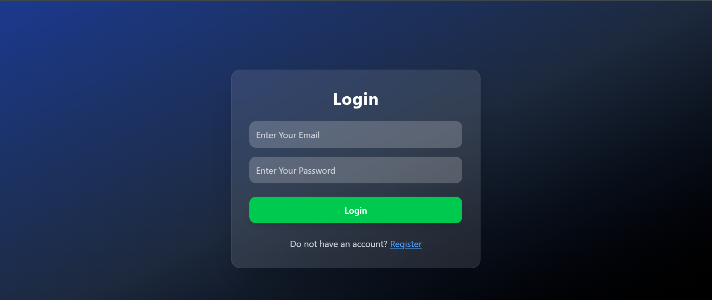
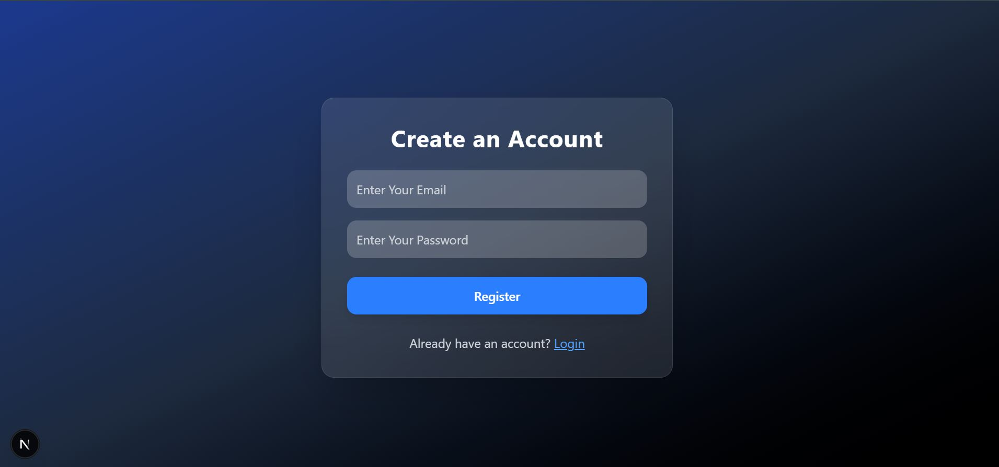
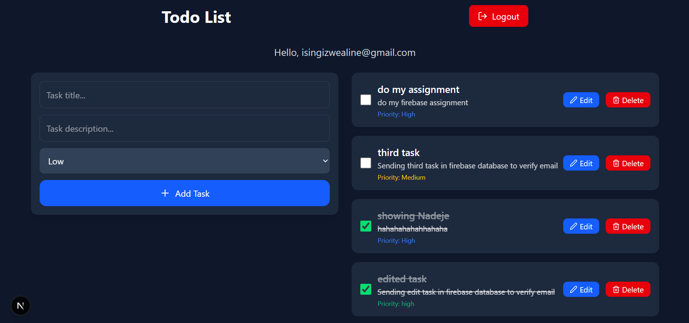

# Todo App — Next.js 14 + Firebase (Auth + Firestore)

A modern, fast, and fully functional Todo Application built using Next.js App Router, TypeScript, Firebase Authentication, and Cloud Firestore.
Users can register, log in, create tasks, edit tasks, mark tasks as completed, and delete tasks — all securely handled through API routes.

# Features
```
- User Registration & Login (Firebase Auth)
- Protected Routes — only logged-in users can access the Todo dashboard
-Create tasks
- Fetch tasks (per logged-in user only)
- Update tasks
- Mark tasks as completed / not completed
- Delete tasks
- Server-side API routes (Next.js App Router)
- Fully typed with TypeScript
- Beautiful UI with TailwindCSS + Framer Motion
- Real-time refresh after each action
```

## Tech Stack
```

| Category             | Technologies Used                          |
|----------------------|--------------------------------------------|
| Frontend Framework   | Next.js 14 (App Router)                    |
| Programming Language | JavaScript (ES6+)                          |
| Styling              | Tailwind CSS                               |
| UI Components        | Custom React Components                    |
| Authentication       | Firebase Authentication                    |
| Database             | Firebase Firestore                         |
| Backend API          | Next.js API Routes (`app/api/tasks/...`)   |
| State Management     | React Hooks (useState, useEffect)          |
| Data Fetching        | Fetch API                                  |
| Deployment           | Vercel                                     |
| Version Control      | Git & GitHub                               |

```

# Project Structure


```
project/
│
├── app/
│   ├── api/
│   │   └── tasks/
│   │       ├── route.ts        # GET + POST tasks
│   │       └── [id]/
│   │           └── route.ts    # PATCH + DELETE a task
│   │
│   ├── login/
│   │   └── page.tsx            # Login form
│   ├── register/
│   │   └── page.tsx            # Register form
│   └── page.tsx                # Home (Todo Dashboard)
│
├── lib/
│   ├── firebase.ts             # Firebase config
│   └── auth.ts                 # login/register/logout functions
│
├── types/
│   └── task.ts                 # Task type definition
│
└── README.md
```

## Firebase Setup
```
1. Go to https://console.firebase.google.com/

2. Create a new Firebase project

3. Enable Authentication → Email/Password

4. Create Firestore Database

5. Copy your Firebase config from Project Settings
```

### Inside app/lib/firebase.ts:

``` 
import { initializeApp } from "firebase/app";
import { getAuth } from "firebase/auth";
import { getFirestore } from "firebase/firestore";

const firebaseConfig = {
  apiKey: process.env.NEXT_PUBLIC_FIREBASE_API_KEY,
  authDomain: process.env.NEXT_PUBLIC_FIREBASE_AUTH_DOMAIN,
  projectId: process.env.NEXT_PUBLIC_FIREBASE_PROJECT_ID,
  storageBucket: process.env.NEXT_PUBLIC_FIREBASE_STORAGE_BUCKET,
  messagingSenderId: process.env.NEXT_PUBLIC_FIREBASE_MESSAGING_SENDER_ID,
  appId: process.env.NEXT_PUBLIC_FIREBASE_APP_ID,
};

const app = initializeApp(firebaseConfig);

export const auth = getAuth(app);
export const db = getFirestore(app);
```

### API Documentation

```
Create a Task

POST /api/tasks

Body:

{
  "title": "Finish project",
  "description": "Do all components",
  "priority": "High",
  "completed": false,
  "userEmail": "example@gmail.com"
}
```

```
Get Tasks for Logged-in User

GET /api/tasks?userEmail=example@gmail.com

Response:

[
  {
    "id": "abc123",
    "title": "Finish project",
    "description": "Do all components",
    "priority": "High",
    "completed": false,
    "userEmail": "example@gmail.com"
  }
]

```
```
Update Task (Edit or Checkbox)

PATCH /api/tasks/:id

Body:

{
  "completed": true
}

```
```
Delete Task

DELETE /api/tasks/:id
```

## Login Page


## Register Page


## Dashboard



# Running the Project
### Install packages:
npm install

#### Run the dev server:
npm run dev

Open http://localhost:3000

# Testing Credentials 

Email: isingizwealine@gmail.com
Password: 123456789